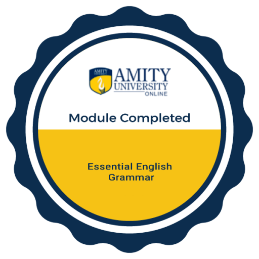
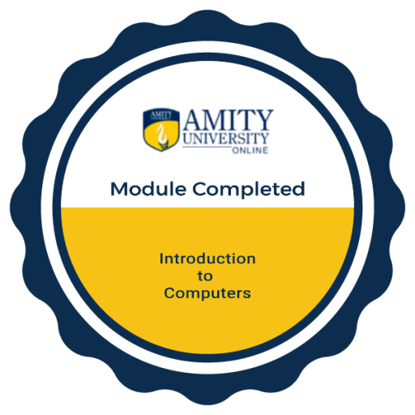

<!-- Header Banner -->

  

<h3 align="center">✨ BCA Student | Cloud & Security | Cybersecurity Learner ✨</h3>

  

---

## 🎓 Education
- **Bachelor of Computer Applications (BCA)** — Cloud & Security specialization  
- **Amity University Online**  
- Semester 1 (Current)

---

## 📘 Semester 1 Academic Progress

### Subjects
- Basic Mathematics  
- Business Communication  
- Computer & Information Technology  
- Programming in C  
- Introduction to Cyber Laws  

### Badges Earned (Organized by Subject)

#### 🧮 Basic Mathematics
- Set Theory and Matrices  
  

#### 📝 Business Communication
- Essential English Grammar  
    
- Written English Communication  
  

#### 💻 Computer & Information Technology
- Introduction to Computers  
  

#### ⚙️ Programming in C
- No badge yet  

#### ⚖️ Introduction to Cyber Laws
- No badge yet  

**Progress Summary:**  
- ✅ 4 Modules Completed  
- 🏅 4 Academic Badges Earned  
- 📚 5 Subjects in Semester 1  

---

## 📜 Certifications & Training
- **Google Cybersecurity Professional Certificate** — Completed all 9 courses  
- **Microsoft Student SOC Program Foundations Training** — Completed  
- **Google Cloud Security Engineer** — Currently learning  

---

## 🔐 Cybersecurity Learning Areas
- Cybersecurity Fundamentals  
- Network Security  
- Linux & System Security  
- Defensive Security  
- Threat Detection  
- Incident Response  
- Security Monitoring & SIEM  
- Cloud Security  
- Python for Security Automation  
- AI in Cybersecurity  

---

## 🛠️ Technical Toolkit

**Languages:**  
  
  
  
  
  

**Operating Systems:**  
  
  
  
  

**Tools & Technologies:**  
  
  
  
  
  

**Cybersecurity Tools:**  
  
  
  
  

---

## 📊 GitHub Stats

  
  

---

## 🌱 Current Goals
- Strengthen fundamentals in **programming and mathematics**  
- Gain hands‑on practice with **cybersecurity tools and labs**  
- Build small but impactful projects to showcase learning progress  
- Prepare for **internship opportunities** in cybersecurity  

---

<!-- Footer Banner -->

  

